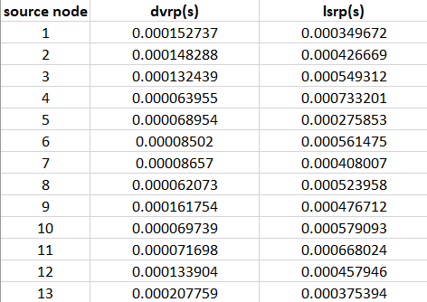
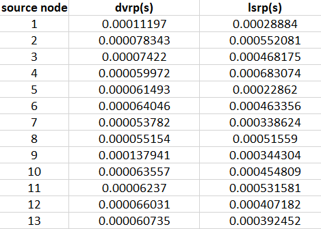

# CN-CA3🌐
## Computer Network CA3. 📡

### Amir-Hossein Shahgholi (SID: 810199441)🎓

### Erfan-Soleymani (SID: 810199439)🎓
</br>

In this CA we simulated some routing protocols, `Distance Vector`, `Link State`, and `BGP(Border Gateway)`;

## Run
Step1:
```bash
make
```
Step2:
```bash
make run
```

## Commands
You can implement Network topology using command line arguments
Example:
```bash
topology 1-2-2 1-3-3 1-4-4
```

you can print graph's adjacency matrix. The -1 means there's no edges connecting two nodes
Example:
```bash
show
```

you can modify weight of an edge between two nodes. The numbers in front of 'modify' are the nodes which the edge will be modified between them and the weight
Example:
```bash
modify 3-5-9
```

you can run a distance vector routing protocol. The number in front of 'dvrp' is the node which you want to run a distance vector routing protocol for
Example:
```bash
dvrp 3
```

you can run a link state routing protocol. The number in front of 'lsrp' is the node which you want to run a link state routing protocol for. After each iteration it will print the nodes table
Example:
```bash
lsrp 3
```

you can remove edge between two nodes. The numbers in front of 'remove' are the nodes which the edge will be removed between them
Example:
```bash
remove 3-5
```

## Results
before removing 4-10



after removing 4-10


